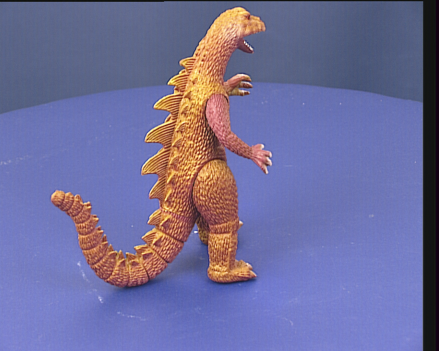
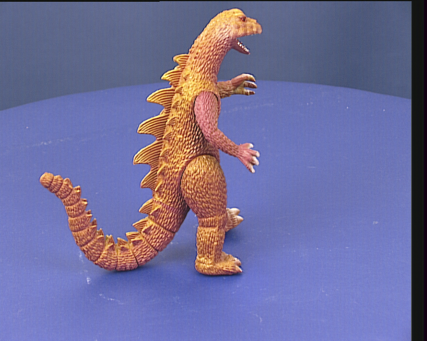
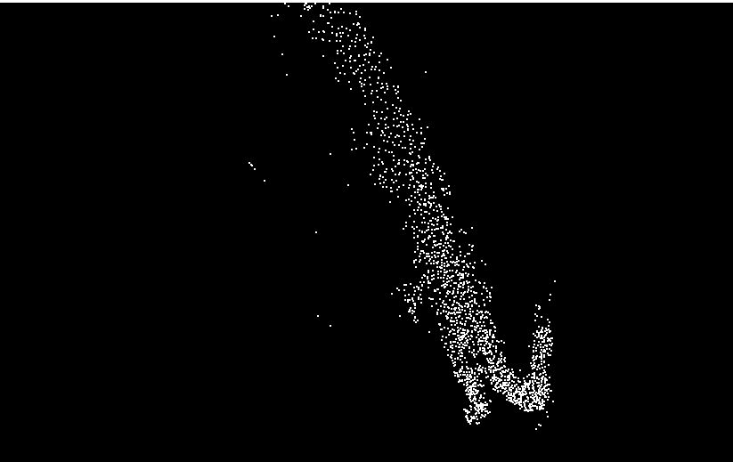
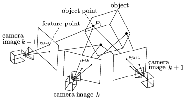
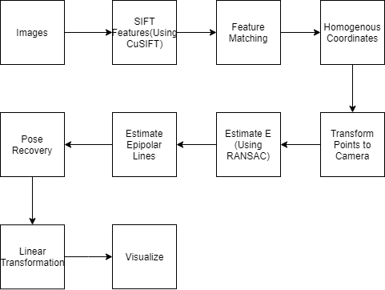

CUDA Structure From Motion
======================

**University of Pennsylvania, CIS 565: GPU Programming and Architecture, Project 4**

* Dewang Sultania
  * [LinkedIn](https://www.linkedin.com/in/dewang-sultania/)
* Tested on: Windows 10, Intel Xeon E-2176M @ 2.70GHz 16GB, Quadro P2000 4GB (Personal Computer)
* Dependencies: cublas, opencv, curand, cusolver, cuSIFT, openGL

### Table of Contents
1. [Overview](#overview)
2.   [Structure From Motion](#sfm)
3.   [Pipeline](#pipeline)
4.   [Experience](#experience)
4.   [References](#references)

<a name = "overview"/>

## Overview

This repository contains code for Structure of Motion on CUDA, it involved multiple mathematical operations like batched SVD, matrix multiplication, transpose. This project was done in collaboration with Vaibhav Arcot.

The work distribution is highlighted here:

Dewang  - Batched SVD, Visualization, Matrix Multiplication Batched, Estimating E Matrix, Batch Matrix Inverse, Integration.

Vaibhav - Estimating E Matrix, RANSAC, 3X3 SVD, Choose Pose, Linear Triangulation, Compute Pose Candidates. 

Together - CuSIFT Integration and Code Integration

<a name = "sfm"/>

## Structure From Motion

Image 1             |  Image 2 |  Result
:-------------------------:|:-------------------------:|:-------------------------:
 | | 

**Structure from motion** (**SfM**) is a photogrammetric range imaging technique for estimating three-dimensional structures from two-dimensional image sequences that may be coupled with local motion signals. It is studied in the fields of computer vision and visual perception. In biological vision, SfM refers to the phenomenon by which humans (and other living creatures) can recover 3D structure from the projected 2D (retinal) motion field of a moving object or scene.

<a name = "pipeline"/>

## Pipeline

<a name = "experience"/>

## Experience

The project turned out to be much harder than we originally envisioned, we had fun setting up a project from scratch, we hit major roadblocks when it came to batching linear algebra operations on cuda especially because we were trying to do it in kernels and cusolver gave major issues because of how it handles array ordering, we finally came through but ended up consuming 2 late days, the other major roadblock was RANSAC which took a lot of time to debug and get it up and running.

## References

1. https://github.com/alyssaq/3Dreconstruction
2. http://ece631web.groups.et.byu.net/Lectures/ECEn631%2013%20-%208%20Point%20Algorithm.pdf
3. http://www.robots.ox.ac.uk/~vgg/hzbook/

